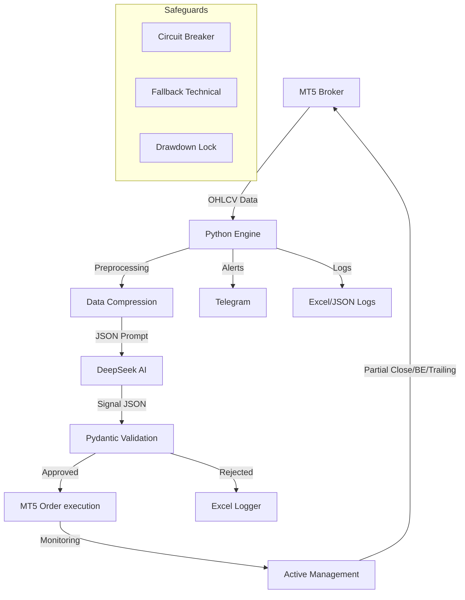

# 🤖 FXBOT EUR/USD v2.0 — AI Trading System

<!-- MIGRATION-EURUSD : Migration complète XAU/USD → EUR/USD (2026-04-15) -->

FXBOT EUR/USD est un bot de trading algorithmique pour la paire **EUR/USD** basé sur l'IA DeepSeek et MetaTrader 5. La version 2.0 apporte une architecture orientée résilience, une gestion de risque dynamique et une observabilité complète via Excel.

---

## 🏗 Architecture V2



---

## 🚀 Installation

1. **Prérequis** : Python 3.11+ et terminal MetaTrader 5 installé.
2. **Installation des dépendances** :
   ```bash
   pip install -r requirements.txt
   ```
3. **Configuration** :
   - Copiez `.env.example` vers `.env`.
   - Remplissez vos clés API (DeepSeek, Telegram) et identifiants MT5.
4. **Lancement** :
   ```bash
   python bot.py
   ```

---

## 🛡 Sécurité & Résilience (Safeguards)

- **Circuit Breaker** : Si l'API DeepSeek échoue 5 fois, le bot bascule en mode technique pur ou se met en pause 15 min.
- **Fallback Technique** : Algorithme de secours basé sur l'alignement EMA + RSI en cas d'indisponibilité de l'IA.
- **Observabilité Excel** : Suivi en temps réel des trades, des sessions et des signaux refusés dans `fxbot_eurusd_performance.xlsx`.  <!-- MIGRATION-EURUSD -->
- **Alertes Proactives** : Pause automatique si le Win Rate chute sous 40% ou si le Drawdown atteint 3%.

---

## 📊 Commandes Telegram

- `/start` : Démarrer le bot.
- `/stop` : Arrêt d'urgence.
- `/status` : État actuel, P&L du jour et latence IA.
- `/analyze` : Force une analyse immédiate.
- `/setrisk X` : Change le risque maximum (ex: `/setrisk 1.5`).

---

## 📝 Licence
Usage privé uniquement. FXBOT EUR/USD n'est pas un conseil en investissement. Le trading de CFD comporte des risques élevés.  <!-- MIGRATION-EURUSD -->
